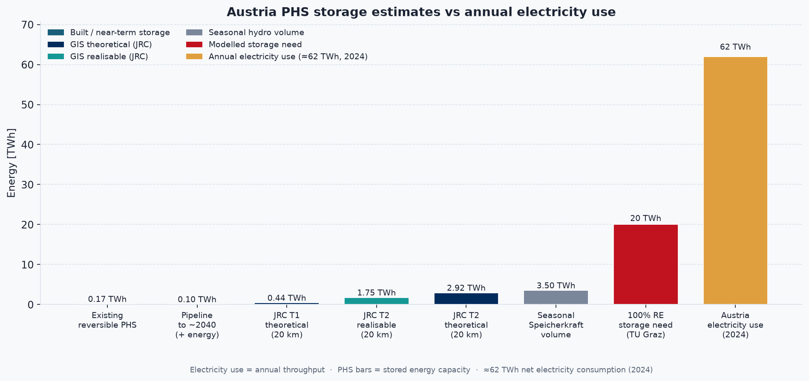
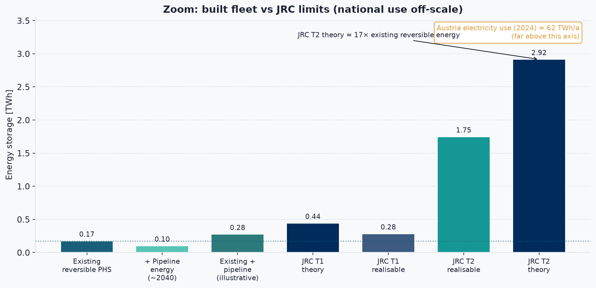
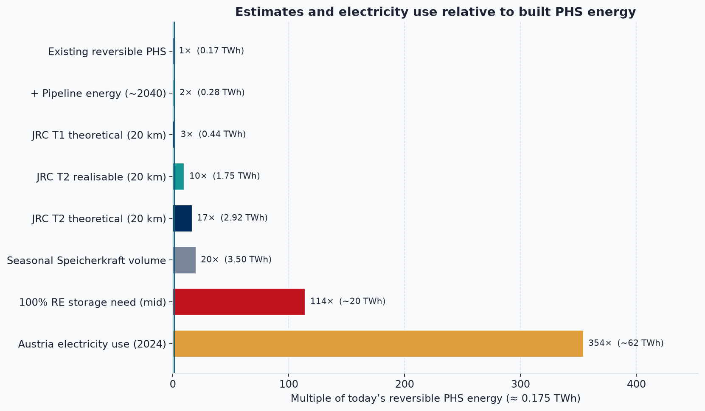
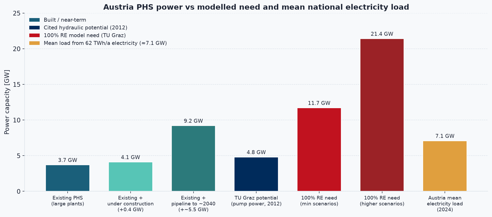
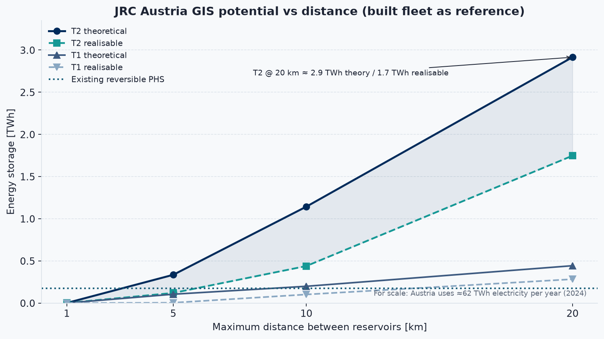

# Theoretical pumped-hydro potential in Austria

**What existing research says about the upper bound** — from today’s fleet, through linking existing reservoirs, to greenfield alpine valleys.

This note synthesises published estimates. It does **not** run a new DEM scan of Austrian valleys; it documents how researchers have already quantified that idea.

---

## Short answer

| Question | Best research answer |
|----------|----------------------|
| How much **reversible** PHS energy do we already have? | ~**0.14–0.21 TWh** (short-cycle pump/turbine energy) |
| How much water energy sits in alpine **storage reservoirs** (mostly seasonal, not all pumpable)? | ~**2–4 TWh** at full supply |
| **Theoretical** new PHS if we can add a second basin near existing reservoirs (JRC T2, 20 km)? | ~**2.9 TWh** (Austria-specific GIS) |
| Of that, after nature/population/infra filters (**realisable**)? | ~**1.7 TWh** |
| Linking **two existing** reservoirs only (JRC T1, 20 km)? | ~**0.44 TWh** theoretical / **0.28 TWh** realisable |
| Project pipeline to ~2040 (not theoretical)? | ~**+5.5 GW** power, ~**+100 GWh** energy |
| True **greenfield** “any alpine valley” (two new off-river lakes)? | **Not quantified for Austria alone** in the literature surveyed; European GIS atlases imply the topographic resource is **orders of magnitude larger** than T1/T2 |

**Bottom line:** Under the strongest *Austria-specific* GIS study that still uses existing waterbodies (JRC 2013), the theoretical ceiling is about **3 TWh** of new storage energy — roughly **10–20×** today’s reversible PHS energy, but still far below the **17–23 TWh** seasonal storage some 100 % renewable scenarios need. A pure “fill every suitable alpine valley” limit has not been published as an Austria total; global closed-loop atlases suggest topography alone is not the binding constraint.

---

## Charts: built vs estimates

Figures are generated by `plot_phs_potential.py` into `hydro_data/figures/`.

```bash
.venv/bin/python plot_phs_potential.py
```

**National electricity reference (2024):** ≈ **62 TWh/a** net electricity consumption  
(EIA ≈ 61.6 TWh; round figure used in charts).

> **Note — same unit (TWh), different meaning**
>
> Most bars are **storage capacity** (energy that can be held *once* in reservoirs / modelled tanks): existing reversible PHS, JRC T1/T2, Speicherkraft volume, 100 % RE storage need.
>
> The **Austria electricity use** bar is **annual throughput** — electricity consumed over a whole year. It is *not* “production stored in lakes,” and the storage bars are *not* “TWh generated per year.”
>
> They share the unit **TWh** only for scale. A rough conversion:
> `days of AT electricity ≈ (storage TWh ÷ 62) × 365`
> e.g. JRC T2 theory ~2.9 TWh ≈ **~17 days** of national electricity use if emptied once — not 2.9 TWh of yearly generation.
>
> If a PHS plant cycles many times per year, **annual energy moved** can exceed its storage capacity (capacity × cycles). The charts do **not** show that cycling total unless labeled as yearly use.

### Energy — full scale (storage + Austria electricity use)



Annual **electricity use** (~62 TWh) dwarfs today’s PHS and JRC T2. The 100 % RE *storage need* (~20 TWh) is still well below a year of electricity use.

### Energy — zoom on built vs JRC GIS



Without the electricity bar, the gap between the **built fleet** and **JRC theoretical / realisable** limits is clearer: T2 theory is about **17×** existing reversible energy. Annual electricity use is noted as off-scale.

### Relative size (multiples of what is built)



### Power — built / pipeline vs modelled need



Known projects roughly **double** turbine power by ~2040. The amber bar is Austria’s **mean electricity load** (~7 GW from 62 TWh/a) — not peak demand, just the year-average.

### JRC Austria curves vs distance



As the allowed penstock distance grows, T2 potential rises steeply. The dotted line is today’s reversible energy (~0.175 TWh midpoint).

---

## Layers of “potential” (do not mix them)

Researchers use the word *potential* for very different things:

```text
① Installed fleet          what exists today (MW / GWh)
② Project pipeline         licensed / planned / under construction
③ Retrofit / pair lakes    connect or extend EXISTING reservoirs   ← JRC T1, T2, eStorage
④ Greenfield alpine        two NEW basins in hills / dry valleys   ← ANU closed-loop atlas
⑤ Seasonal hydro volume    energy in Speicherkraftwerke lakes      ← often NOT fully pumpable
```

Austria’s Alps make ③ and ④ look enormous on a map. Published numbers are mostly **③**; **④** is mapped globally but rarely broken out as an Austria total.

---

## 1. Today’s position (baseline)

| Metric | Approximate value | Source |
|--------|------------------:|--------|
| PHS turbine capacity | ~**3.4–5 GW** (definitions vary; large plants ≥50 MW often cited ~3.7 GW) | JRC country sheet; Aufleger compilation in *Mountain Research and Development* (2016) |
| Reversible energy content (pump cycle) | **143 GWh** (~0.14 TWh); later scenarios use ~**210 GWh** including projects | TU Graz / Groiss & Boxleitner (EnInnov 2012); Groiss (2014) |
| Energy in storage hydro reservoirs at full supply | ~**3 TWh** (Speicherkraftwerke); parliamentary synthesis **3–4 TWh** | Groiss (2012); ITA/AIT *Zwischenspeicher* (2019) |
| Large-plant basins only (another estimate) | ~**1.9 TWh** developed; total potential ~**2.9 TWh** if ~⅔ developed | Hala, TU Wien (2012) |

Important distinction: **3 TWh in Speicherkraftwerke** is gravitational energy of stored water for *generation*. Only a fraction is **reversible** (can be pumped back). That reversible slice is the ~0.14–0.21 TWh class of figures.

---

## 2. GIS theoretical limit using existing reservoirs — JRC (best Austria number)

**Study:** Gimeno-Gutiérrez & Lacal-Arántegui, *Assessment of the European potential for pumped hydropower energy storage*, European Commission JRC (2013).  
**PDF:** [JRC81226](https://publications.jrc.ec.europa.eu/repository/bitstream/JRC81226/ldna25940enn_assessment_european_phs_potential_online.pdf)

### Topologies

| Code | Meaning | Alpine “valley” idea? |
|------|---------|------------------------|
| **T1** | Link **two existing** reservoirs with enough head and limited distance | No new lake |
| **T2** | Keep **one** existing reservoir; site a **new** second basin nearby (flat area, depression, or valley) | **Partial yes** — one new basin |
| **T3** | Fully greenfield (two new reservoirs / dammed valleys) | **Full yes** — **not modelled** by JRC |

Minimum head in the main scenarios: **150 m**. Distances: 1–20 km.  
**Realisable** = theoretical minus sites near towns, protected nature, transport, etc.

### Austria results (energy storage, GWh)

| Scenario | T1 theoretical | T1 realisable | T2 theoretical | T2 realisable |
|----------|---------------:|--------------:|---------------:|--------------:|
| **1 km** | 0 | 0 | 1 | 1 |
| **5 km** | 105 | 4 | 335 | 120 |
| **10 km** | 199 | 102 | 1 143 | 439 |
| **20 km** | **443** | **283** | **2 915** | **1 747** |

At 20 km / T2 Austria also has **142** theoretical sites (avg head ~869 m) and **114** realisable sites (avg head ~758 m).

**Interpretation for a theoretical limit under “use the Alps but stay tied to existing water infrastructure”:**

> **~2.9 TWh theoretical / ~1.7 TWh realisable**  
> (JRC T2, 20 km)

That is the cleanest published *Austria-specific* ceiling short of full greenfield damming.

JRC’s Europe-wide comparison: for a sample of countries including Austria, **T1 theoretical ≈ 3.5×** existing PHS energy, and **T2 realisable ≈ 10×** existing.

---

## 3. Expert-filtered “feasible” new sites — eStorage (2016)

**Study:** EC FP7 *eStorage* / DNV GL GIS + national hydro experts.  
**Headline:** **2 291 GWh** development-ready potential across EU-15 + Norway + Switzerland, by **pairing existing reservoirs** (cost-advantaged; not greenfield valleys).

| Region | Feasible energy |
|--------|----------------:|
| Southern Norway | 1 242 GWh (54 %) |
| **Alps (AT, FR, IT, CH + DE Alps)** | **303 GWh (13 %)** |
| Pyrenees (FR, ES) | 118 GWh |

Austria is **not published separately** in the press summary — only as part of the Alpine **303 GWh**. This is a **realisable / expert-vetted** figure, much tighter than raw JRC T1/T2 theoretical totals.

---

## 4. Greenfield alpine valleys — what research exists?

Your framing (“a valley between two mountains could be filled”) is essentially **JRC topology T3** / **ANU closed-loop off-river PHS**:

- two (often small) reservoirs  
- off main rivers where possible  
- water cycled indefinitely  

### What was assessed

| Study | Scope | Austria total? |
|-------|-------|----------------|
| JRC (2013) | Explicitly **did not** compute T3 Europe-wide | No |
| ANU Global Atlas (Blakers et al., *Joule*, 2021) | Global DEM search: **~616 000** closed-loop sites, **~23 000 TWh** world total | **No Austria row** in public regional summary; Western Europe region alone ~**78 TWh** / ~3 000 pairs |
| TIWAG Kaunertal / Platzertal geology | Site-level alpine upper-reservoir siting | Project examples, not national inventory |

**ANU implication:** where there is steep relief (the Alps), closed-loop topography is abundant — far beyond what the grid needs. Europe’s combined UN sub-regions are cited at **>2 700 GWh per million people** of atlas resource vs a rough need of ~**20 GWh per million people** for high-VRE systems.

**Honest gap:** a peer-reviewed **Austria-only T3 / dry-valley inventory in TWh** was **not found** in this survey. The JRC T2 **2.9 TWh** remains the best *national* theoretical number; ANU shows the *topographic* ceiling for full greenfield is conceptually much higher but unallocated to Austria in open tables.

---

## 5. Project pipeline (practical next GW) — SpeicherPot / operators

**SpeicherPot** (AIT et al., EnInnov 2026 presentation; KLIEN/FFG): *no classical resource potential* for PHS — instead a **project list** (planning lead times dominate).

| Horizon | Extra turbine power | Extra storage energy (order of) |
|---------|--------------------:|--------------------------------:|
| ~2030 (under construction) | ~**+1 GW** | ~**+15 GWh** |
| ~2040 (planning / concept) | ~**+4.5 GW** | ~**+100 GWh** total uplift cited |

Examples named: Kühtai 2, Ebensee, Limberg 3, Tauernmoos, Reisseck 2 plus; later Riedl, Molln, Versetz, Koralm, Lünerseewerk 2, Salza, St. Georgen, Schaufelberg, …

*Mountain Research and Development* (2016) similarly put Austria at ~**3.7 GW** existing, **0.4 GW** under construction, **2–3 GW** planned (large plants).

This is **not** a theoretical limit — it is what the industry already has on paper.

---

## 6. How much storage would Austria *need*?

Several TU Graz / stoRE studies ask the inverse question.

| Study | Finding |
|-------|---------|
| Boxleitner et al. (EnInnov 2012) | For 100 % renewable electricity, needed storage **17–23 TWh** and **11–21 GW** pump power — vs Austrian hydraulic storage potential then taken as **0.14 TWh** / **4.8 GW** |
| Groiss (2012) | PS energy **0.14 TWh** cannot absorb seasonal surplus (~16 TWh class); PHS is for **short** balancing |
| stoRE / Austria brief | Modelled Austrian PHS capacity as **2 TWh** (elevation energy of reservoirs); still **power**, not energy, constrains deep RE integration with neighbours |
| Hala (2012) | Autarky 2050 seasonal demand **5.3–7.2 TWh/a**; current large basins **1.9 TWh**; PHS alone insufficient for summer→winter |

So even if JRC’s **~3 TWh** theoretical T2 were fully built, Austria would still need **other seasonal storage** (PtG/H₂, thermal, imports, demand response) for deep decarbonisation scenarios.

---

## 7. Visual summary

```text
Energy storage scale (log-ish)

Seasonal need (100% RE studies)     ████████████████████  17–23 TWh
JRC T2 theoretical (AT, 20 km)      ███                   ~2.9 TWh
Seasonal Speicherkraft volume       ███                   ~3–4 TWh
JRC T2 realisable                   ██                    ~1.7 TWh
stoRE modelling assumption          ██                    ~2 TWh
JRC T1 theoretical                  ▌                     ~0.44 TWh
eStorage Alps (4 countries)         ▌                     ~0.30 TWh
Existing reversible PHS             ·                     ~0.14–0.21 TWh
Pipeline to 2040 (SpeicherPot)      ·                     ~+0.1 TWh
ANU greenfield (AT not broken out)  ████████████████████… >> T2 (unknown AT total)
```

See also the charts in **[Charts: built vs estimates](#charts-built-vs-estimates)** above.

---

## 8. Takeaways for a “theoretical alpine limit”

1. **Best published Austria-specific theoretical figure:** **~2.9 TWh** (JRC T2 @ 20 km) — one existing reservoir + new partner basin within 20 km and ≥150 m head.  
2. **After soft constraints:** **~1.7 TWh** realisable.  
3. **Pairing only existing lakes:** **~0.4 TWh** theoretical.  
4. **Expert-feasible Alpine new build (multi-country):** **~0.3 TWh** (eStorage).  
5. **Industry roadmap:** roughly **double today’s GW** by 2040 on known projects (~**+5 GW**, ~**+0.1 TWh** energy — power-heavy, energy-light).  
6. **Full “dam any suitable alpine valley” (T3):** conceptually huge (ANU global atlas), **but no Austria-only TWh total** was located; that would be the next research step with a national DEM (e.g. BEV 50 m / 1 m ALS).  
7. **Theoretical PHS ≪ seasonal need** in 100 % RE studies — topography enables a large *power* and *days-to-weeks* resource; it does not by itself solve *seasonal* storage.

---

## Key sources

| Source | Year | What it contributes |
|--------|------|---------------------|
| [JRC PHS potential assessment (Gimeno-Gutiérrez & Lacal-Arántegui)](https://publications.jrc.ec.europa.eu/repository/bitstream/JRC81226/ldna25940enn_assessment_european_phs_potential_online.pdf) | 2013 | Austria T1/T2 GWh tables — **primary theoretical numbers** |
| [eStorage / DNV GL press release](https://www.dnv.com/news/2016/estorage-study-shows-huge-potential-capacity-of-exploitable-pumped-hydro-energy-storage-sites-in-europe-63675/) | 2016 | Alpine feasible **303 GWh** (existing-reservoir pairs) |
| Groiss / Boxleitner (TU Graz, EnInnov) | 2012–2014 | Existing **143–210 GWh** reversible; **3 TWh** Speicherkraft; need **17–23 TWh** |
| [stoRE Austria executive summary](https://www.store-project.eu/documents/target-country-results/en_GB/energy-storage-needs-in-austria-executive-summary-in-german) | ~2014 | **2 TWh** modelling assumption for Austrian PHS |
| Hala, TU Wien thesis | 2012 | ~**2.9 TWh** total PHS potential, ~⅔ developed |
| Gurung et al., *Rethinking Pumped Storage Hydropower in the European Alps*, MRD | 2016 | Capacity / pipeline context (~3.7 GW + plans) |
| [Blakers et al., Global Atlas of Closed-Loop PHES, *Joule*](https://www.cell.com/joule/fulltext/S2542-4351(20)30559-6) / [ANU atlas](https://re100.eng.anu.edu.au/global/) | 2021 | Global greenfield ceiling; Western Europe ~78 TWh regional |
| SpeicherPot (AIT / Ortmann, EnInnov) | 2026 | Pipeline **+~5.5 GW / +~100 GWh** to 2040 |
| ITA/AIT *Zwischenspeicher der Zukunft* | 2019 | **3–4 TWh** Speicherkraft capacity synthesis |

---

## Relation to this repository

- Operating fleet & reservoirs: [`AUSTRIA_PUMPED_STORAGE.md`](AUSTRIA_PUMPED_STORAGE.md)  
- Example geometry (Schlegeis): `map_reservoir_example.py`  
- Potential comparison charts: `plot_phs_potential.py` → `hydro_data/figures/`  
- Next analytical step (not done here): run a **national T3 / closed-loop** search on BEV DGM 50 m (or ALS 1 m tiles) to produce an Austria-specific greenfield TWh figure comparable to ANU/JRC methods.

*Compiled from literature, September 2026. Figures rounded; always check original tables for scenario definitions (head, distance, constraints).*
