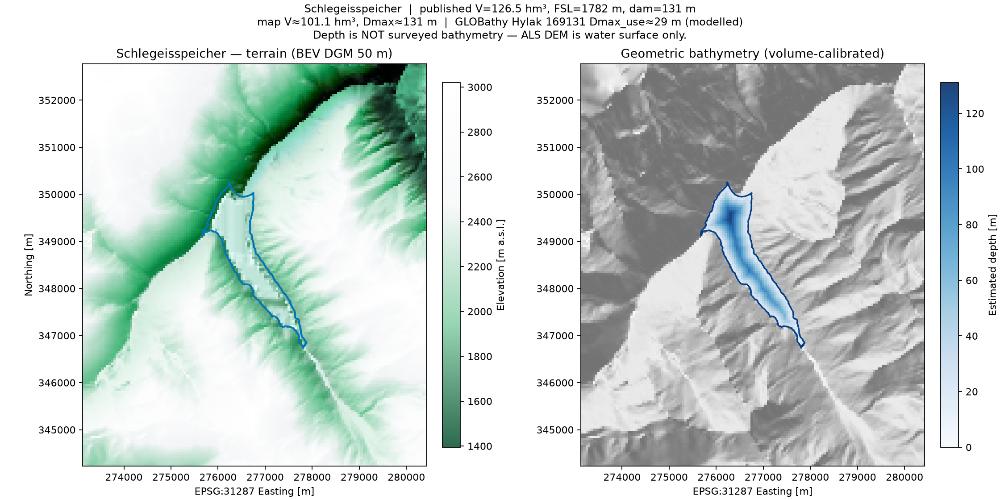

# Austria pumped-storage hydro — overview

Inventory of operating **Pumpspeicherkraftwerke** and the reservoirs / lakes they use.
Machine-readable CSVs live in `hydro_data/`; rebuild with `build_hydro_inventory.py`.

| File | Contents |
|------|----------|
| [`austria_pumped_storage_plants.csv`](hydro_data/austria_pumped_storage_plants.csv) | 21 plants (capacity, year, state, operator) |
| [`austria_pump_hydro_reservoirs.csv`](hydro_data/austria_pump_hydro_reservoirs.csv) | Plant ↔ reservoir links (upper / lower) |
| [`austria_pump_hydro_reservoirs_unique.csv`](hydro_data/austria_pump_hydro_reservoirs_unique.csv) | One row per reservoir |
| [`SOURCES.md`](hydro_data/SOURCES.md) | Source notes & caveats |
| [`schlegeis_example_map.png`](hydro_data/schlegeis_example_map.png) | Example map (Schlegeisspeicher) |

**Total installed pumped-storage capacity (listed plants): ~5.0 GW**

---

## Pumped-storage plants

Sorted by turbine capacity. Capacities are primarily from
[Liste von Pumpspeicherkraftwerken](https://de.wikipedia.org/wiki/Liste_von_Pumpspeicherkraftwerken)
(Österreich) and the starred entries on
[Liste von Wasserkraftwerken in Österreich](https://de.wikipedia.org/wiki/Liste_von_Wasserkraftwerken_in_%C3%96sterreich).

| # | Plant | MW | Commissioned | State | Operator |
|--:|-------|---:|-------------:|-------|----------|
| 1 | Malta-Hauptstufe | 730 | 1979 | Kärnten | VERBUND / AHP |
| 2 | Kopswerk II | 525 | 2008 | Vorarlberg | illwerke vkw |
| 3 | Limberg II | 480 | 2012 | Salzburg | VERBUND / AHP |
| 4 | Reißeck II | 430 | 2015 | Kärnten | VERBUND / AHP |
| 5 | Obervermuntwerk II | 380 | 2019 | Vorarlberg | illwerke vkw |
| 6 | Häusling | 360 | 1988 | Tirol | VERBUND / AHP |
| 7 | Rodundwerk II | 295 | 1976 | Vorarlberg | illwerke vkw |
| 8 | Kühtai | 289 | 1981 | Tirol | TIWAG |
| 9 | Lünerseewerk | 280 | 1958 | Vorarlberg | illwerke vkw |
| 10 | Roßhag | 231 | 1972 | Tirol | VERBUND / AHP |
| 11 | Rodundwerk I | 198 | 1952 | Vorarlberg | illwerke vkw |
| 12 | Feldsee | 140 | 2009 | Kärnten | KELAG |
| 13 | Malta-Oberstufe | 120 | 1992 | Kärnten | VERBUND |
| 14 | Kaprun Oberstufe Limberg | 112.8 | 1955 | Salzburg | VERBUND |
| 15 | Innerfragant I | 108 | — | Kärnten | KELAG |
| 16 | Innerfragant II | 100 | — | Kärnten | KELAG |
| 17 | Reißeck Jahresspeicher | 67.5 | 1961 | Kärnten | VERBUND |
| 18 | Wienerbruck | 66 | 1973 | Niederösterreich | evn naturkraft |
| 19 | Koralpe | 50 | 2011 | Kärnten | KELAG |
| 20 | Erlaufboden | 34 | 1923 | Niederösterreich | evn naturkraft |
| 21 | Ranna | 19 | 1925 | Oberösterreich | Energie AG |

### By federal state

| State | Plants | Approx. MW |
|-------|-------:|----------:|
| Vorarlberg | 5 | ~1 678 |
| Kärnten | 8 | ~1 746 |
| Tirol | 3 | ~880 |
| Salzburg | 2 | ~593 |
| Niederösterreich | 2 | ~100 |
| Oberösterreich | 1 | ~19 |

### By operator group

| Operator | Role |
|----------|------|
| **VERBUND** (AHP) | Malta–Reißeck, Kaprun/Limberg, Zemm–Ziller (Roßhag, Häusling) |
| **illwerke vkw** | Kops, Silvretta/Vermunt, Rodund, Lünersee |
| **TIWAG** | Kühtai / Sellrain–Silz (Finstertal ↔ Längental) |
| **KELAG** | Feldsee, Koralpe, Innerfragant |
| **Energie AG** | Ranna (oldest listed, 1925) |
| **evn** | Wienerbruck, Erlaufboden (small) |

---

## Reservoirs & lakes

Upper / lower basins linked to the plants above, plus a few large Tyrol storage lakes
often discussed with alpine hydro (Achensee, Gepatsch, Durlaßboden).

Volumes with a known value are mostly from VERBUND (EURELECTRIC 2017) and Wikipedia
Stausee infoboxes. Empty volume cells mean the basin is identified but published hm³
was not compiled yet.

### Reservoirs with published volume

| Reservoir | Volume (hm³) | Area (km²) | FSL (m) | Dam (m) | Linked plant(s) | Role |
|-----------|-------------:|-----------:|--------:|--------:|-----------------|------|
| Achensee | 481 | 6.8 | 929 | — | — (TIWAG storage) | storage |
| Kölnbreinspeicher | 200.2 | 2.5 | 1902 | 200 | Malta-Hauptstufe, Malta-Oberstufe, Reißeck II | upper / lower |
| Stausee Gepatsch | 138 | 2.6 | 1767 | 153 | — (TIWAG Kaunertal) | storage |
| **Schlegeisspeicher** | **126.5** | **2.02** | **1782** | **131** | **Roßhag** | **upper** |
| Speicher Zillergründl | 86.7 | 1.28 | 1850 | 186 | Häusling | upper |
| Mooserboden | 84.9 | 1.6 | 2036 | 107 | Limberg II, Kaprun Oberstufe | upper |
| Wasserfallboden | 81.2 | 1.5 | 1672 | 120 | Limberg II, Kaprun Oberstufe | lower |
| Lünersee | 78.3 | 1.55 | 1970 | — | Lünerseewerk | upper |
| Speicher Finstertal | 60 | 1.02 | 2325 | 150 | Kühtai | upper |
| Speicher Durlaßboden | 52 | 1.75 | 1405 | — | — (Gerlos) | storage |
| Kopssee | 42.9 | 1.0 | 1809 | 122 | Kopswerk II | upper |
| Silvretta-Stausee | 38 | 1.3 | 2030 | 80 | Obervermuntwerk II | upper |
| Vermuntsee | 11 | 0.4 | 1743 | 54 | Obervermuntwerk II | lower |
| Speicher Stillupp | 6.8 | 0.55 | 1120 | 28 | Roßhag, Häusling | lower |
| Ausgleichsbecken Längental | 3 | 0.18 | 1900 | — | Kühtai | lower |

### Other linked basins (volume TBD)

| Reservoir | Linked plant(s) | Role |
|-----------|-----------------|------|
| Ausgleichsbecken Rottau / Galgenbichl | Malta-Hauptstufe | lower |
| Reißeck / Großer See group | Reißeck II, Malta-Oberstufe | upper |
| Reißeck Jahresspeicher lakes | Reißeck Jahresspeicher | upper |
| Latschau / Vermunt cascade | Rodundwerk I & II | upper |
| Rodundbecken | Rodundwerk I & II | lower |
| Latschau / Ill cascade | Lünerseewerk | lower |
| Rifa / Vermunt cascade | Kopswerk II | lower |
| Feldsee (Fragant) | Feldsee | upper |
| Wurten / Fragant cascade | Feldsee | lower |
| Fragant / Wurten reservoirs | Innerfragant I & II | upper |
| Koralpe upper / lower basins | Koralpe | upper / lower |
| Ranna / Klaffer + lower basin | Ranna | upper / lower |
| Wienerbruck reservoir | Wienerbruck | upper |
| Erlaufboden reservoir | Erlaufboden | upper |

---

## Major plant groups (schematic)

```text
Kaprun (Sbg)          Mooserboden  ←pump/turbine→  Wasserfallboden
                        Limberg II / Kaprun Oberstufe

Malta–Reißeck (Ktn)   Reißeck lakes  ↔  Kölnbrein  ↔  Rottau/Galgenbichl
                        Reißeck II / Malta-Hauptstufe / Malta-Oberstufe

Zemm–Ziller (Tirol)   Schlegeis ──Roßhag──┐
                      Zillergründl─Häusling─┼→ Stillupp → Mayrhofen
                      (upper PS)            │

Sellrain–Silz (Tirol) Finstertal  ←Kühtai→  Längental
                      Finstertal  ──Silz──→  (turbine-only, not PS)

illwerke (Vbg)        Kops / Silvretta / Vermunt / Lünersee / Rodund cascade
```

---

## Example map: Schlegeisspeicher



| Attribute | Value |
|-----------|------:|
| Outline | Tirol WIS `T2614R1` (~2.02 km²) |
| Published volume | 126.5 hm³ (VERBUND) |
| Full supply level | 1 782 m |
| Dam height | 131 m |
| Linked plant | Roßhag (231 MW) → Stillupp |
| Terrain | BEV DGM 50 m |
| Depth panel | Geometric estimate (distance-to-shore, volume-calibrated) |

```bash
.venv/bin/python map_reservoir_example.py          # interactive window + PNG
.venv/bin/python map_reservoir_example.py --no-show  # PNG only
```

### Bathymetry caveat

Airborne LiDAR / ALS DEMs map the **water surface**, not the lakebed. True operator
bathymetric surveys are rarely public. The blue depth panel is a **geometric estimate**,
not surveyed bathymetry. GLOBathy (HydroLAKES id ≈ 169131) gives a modelled max depth
of ~29 m for this waterbody — typically too shallow for steep alpine dams.

---

## How to regenerate

```bash
.venv/bin/python build_hydro_inventory.py   # refresh CSVs from cached wiki HTML
.venv/bin/python map_reservoir_example.py   # refresh Schlegeis map
```

See [`SOURCES.md`](hydro_data/SOURCES.md) for citations. Official plant register (no reservoir
catalogue): [anlagenregister.at](https://anlagenregister.at/).
