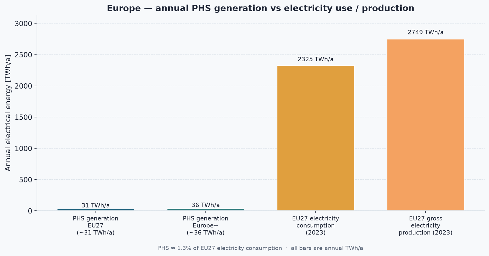
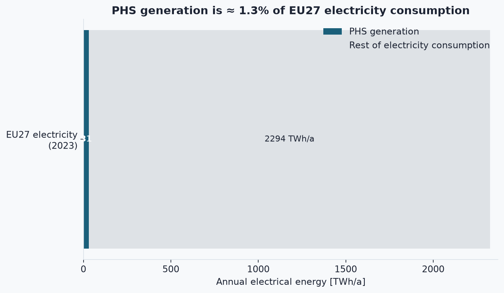
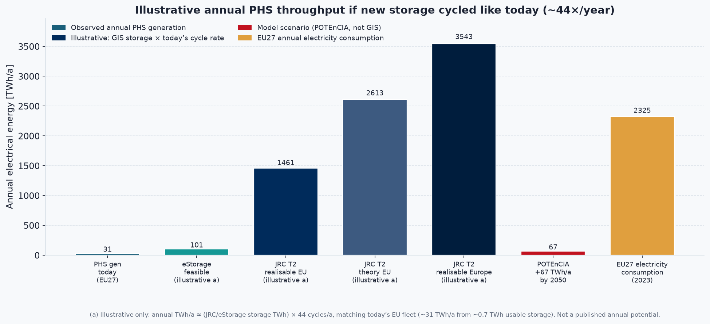
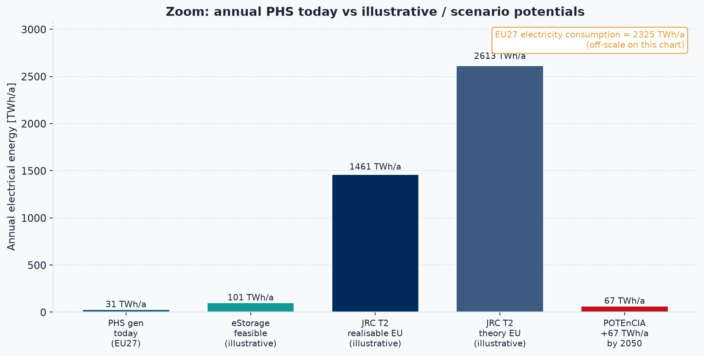

# Europe pumped hydro — annual electricity production vs potential vs consumption

All figures below are **electrical energy over a year** (**TWh/a**), so production and consumption are comparable.  
(This differs from [`AUSTRIA_PHS_THEORETICAL_POTENTIAL.md`](AUSTRIA_PHS_THEORETICAL_POTENTIAL.md), which mixes storage *capacity* with annual use.)

---

## Short answer

| Metric | EU27 | Broader Europe⁺ |
|--------|-----:|----------------:|
| **PHS generation today** | ~**31 TWh/a** | ~**36 TWh/a** |
| **Electricity consumption** | ~**2 325 TWh/a** (2023) | — (use EU27 as main reference) |
| **PHS share of electricity use** | ~**1.3 %** | — |
| **GIS theoretical storage** (JRC T2 @ 20 km) | ~**59 TWh** stock (theory) / ~**33 TWh** realisable | ~**123 TWh** / ~**80 TWh** |
| **Illustrative annual** if that storage were cycled like today’s fleet (~**44×/year**) | ~**1 450–2 600 TWh/a** (theory/realisable band) | up to ~**3 500 TWh/a** (realisable Europe) |
| **Published annual scenario** (POTEnCIA / JRC CETO) | **+67 TWh/a** extra PSH *use* by 2050 | — |

⁺ EU27 + Switzerland, Iceland, Norway, Türkiye, UK (vgbe definition).

**Bottom line:** Today’s pumped hydro **produces only ~1 %** of EU electricity each year. Studies of *new sites* mostly publish **storage capacity** (TWh that can be held once), not TWh/a. Converting capacity → annual generation requires assuming how often reservoirs are cycled; using today’s EU cycling intensity makes the illustrative annual envelope **very large** — on the order of annual EU electricity use — but that is **not** a published “guaranteed TWh/a potential.”

---

## Scope and units

- **Geography:** EU27 unless noted; “Europe⁺” = vgbe set (EU27 + CH + IS + NO + TR + UK).
- **PHS generation:** electricity from turbines in pumped-storage plants over one year (includes generation from previously pumped water; mixed plants split differently in some sources).
- **Consumption:** final electricity use by sector (industry, households, services, transport, agriculture).
- **Not used here:** total final energy (heat, fuels, etc.) — electricity only.

> **Note — capacity vs annual**
>
> GIS studies (JRC, eStorage) report **storage capacity** (TWh *stock*).  
> This page converts those to **illustrative TWh/a** as:
> `annual ≈ storage_capacity × cycles_per_year`
> with `cycles_per_year ≈ 31 / 0.7 ≈ 44`, i.e. today’s EU PHS generation divided by ~0.7 TWh estimated usable PSH storage.
>
> Those converted bars are **labelled illustrative** — they assume new sites would be cycled as hard as today’s fleet and that enough **power capacity (GW)** is built to match. Real annual output also depends on markets, grids, and permitting.

---

## Charts

```bash
.venv/bin/python plot_europe_phs.py
```

### 1. Annual PHS generation vs EU electricity use



### 2. Share of consumption



### 3. Today vs illustrative annual potential (full scale)



### 4. Zoom (without consumption bar)



---

## 1. What is produced and consumed today (annual)

### Pumped-storage generation

| Region | Year / note | PHS generation | Turbine capacity |
|--------|-------------|----------------:|-----------------:|
| **EU27** | Decade average (JRC CETO) | **~31 TWh/a** (range ~28–33) | **~46 GW** |
| **EU27** | vgbe, 2022 | **31 TWh** | **47 GW** |
| **Europe⁺** | vgbe, 2022 | **36 TWh** | **55 GW** |

JRC CETO (2025) also cites ~**40 TWh** pumped and ~**45 TWh** generated for EU PSH in 2023 under one accounting split — definitions of “pure” vs “mixed” PHS differ. This page uses **~31 TWh/a** as the conservative, widely cited EU average.

Pumping consumes **more** electricity than turbines return (round-trip losses). Historically Eurostat-type balances show pumping input > generation output (e.g. ~38 TWh pumped for ~29 TWh generated in older EU figures).

### Electricity consumption / production (EU27)

| Metric | Value | Source |
|--------|------:|--------|
| **Final electricity consumption** (sectors sum, 2023) | **~2 325 TWh** | Eurostat: industry 815 + households 691 + services 703 + transport 70 + agriculture 46 |
| **Gross electricity production** (2023) | **~2 749 TWh** | Eurostat |

So annual PHS output is roughly:

- **31 / 2 325 ≈ 1.3 %** of EU electricity *consumption*  
- **31 / 2 749 ≈ 1.1 %** of EU gross *production*

---

## 2. Theoretical / realisable potential in the literature

Most European PHS “potential” studies report **storage energy (TWh stock)** or **power (GW)**, not annual TWh/a.

### JRC GIS (Gimeno-Gutiérrez & Lacal-Arántegui, 2013)

Topology **T2** = one existing reservoir + new partner basin; distance up to **20 km**; min head **150 m**.

| Region | T2 theoretical (stock) | T2 realisable (stock) |
|--------|----------------------:|----------------------:|
| **EU** | ~**59 TWh** | ~**33 TWh** |
| **Europe** (study area) | ~**123 TWh** | ~**80 TWh** |

Topology **T1** (link two existing reservoirs) is smaller: Europe theory ~**54 TWh**, realisable ~**29 TWh** at 20 km.

### eStorage (2016)

Expert-filtered **feasible** new plants on **existing reservoir pairs**: **2 291 GWh = 2.3 TWh** storage (EU-15 + Norway + Switzerland). Dominated by southern Norway (~1.2 TWh of that total).

### Other annual-oriented figures

| Source | What it says |
|--------|----------------|
| **POTEnCIA** (cited in JRC CETO) | **+67 TWh** extra annual PSH *use* and **+8.3 GW** by **2050** vs 2025 — a **model scenario**, not a GIS ceiling |
| Projections of installed PSH power | Often **~70–75 GW** EU by 2050 (from ~46 GW today) |
| Quaranta et al. / Stocks–Hunt syntheses | Remaining **closed-loop storage** potential in the EU can be **tens to >100 TWh stock**, but best sites are taken; costs rise |

---

## 3. Turning storage potential into annual TWh/a (illustrative)

Today (order of magnitude):

| Quantity | Value |
|----------|------:|
| EU PHS generation | ~31 TWh/a |
| Usable PSH storage (technical estimates) | ~0.5–0.8 TWh (mid **0.7**) |
| Implied full cycles | **~44 / year** |

**Illustrative annual generation** if new GIS storage were built and cycled at that rate:

| Storage basis | Stock (TWh) | × 44 cycles → TWh/a |
|---------------|------------:|--------------------:|
| eStorage feasible | 2.3 | ~**100** |
| JRC T2 realisable EU | 33 | ~**1 460** |
| JRC T2 theoretical EU | 59 | ~**2 610** |
| JRC T2 realisable Europe | 80 | ~**3 540** |

Compare to **~2 325 TWh/a** EU electricity consumption: the large JRC-based illustrative annual figures are **the same order of magnitude as (or larger than) annual EU electricity use** — which shows that **storage stock × high cycling** is an aggressive upper sketch, not a forecast. Delivering that would need enormous **GW** of turbines/pumps and continuous surplus energy to pump.

The **POTEnCIA +67 TWh/a by 2050** figure is a more cautious **published annual** trajectory.

---

## 4. Takeaways

1. **Today:** EU pumped hydro generates ~**31 TWh/a** — about **1 %** of EU electricity consumption (~**2 325 TWh/a**).  
2. **Published GIS “potential”** is mostly **TWh of storage**, not TWh/a.  
3. **Illustrative annual** conversion (× today’s ~44 cycles/a) makes JRC T2 realisable EU look like ~**1 500 TWh/a** — a **theoretical sketch**, not an official annual potential.  
4. **Policy/model annual** add: on the order of **+67 TWh/a** by 2050 (POTEnCIA), alongside growth toward ~**70 GW** class installed power.  
5. Even large PHS growth remains a **flexibility / storage** tool; it does not replace the bulk of annual electricity supply.

---

## Key sources

| Source | Contribution |
|--------|----------------|
| [vgbe — Hydropower in Europe: Facts and Figures](https://www.vgbe.energy/wp-content/uploads/2023/04/Hydropower-in-Europe-Facts-and-Figures-2023-Final.pdf) | EU27 / Europe⁺ PHS generation & capacity (2021–2022) |
| [Eurostat — Electricity and heat statistics](https://ec.europa.eu/eurostat/statistics-explained/index.php?title=Electricity_and_heat_statistics) | EU gross production & sectoral electricity consumption |
| [JRC CETO — Hydropower and PSH in the EU](https://publications.jrc.ec.europa.eu/repository/bitstream/JRC143929/JRC143929_01.pdf) | ~31 TWh/a average PSH; 46 GW; POTEnCIA +67 TWh; storage estimates |
| [JRC GIS PHS potential (2013)](https://publications.jrc.ec.europa.eu/repository/bitstream/JRC81226/ldna25940enn_assessment_european_phs_potential_online.pdf) | Europe/EU T1–T2 storage potential (TWh stock) |
| [eStorage / DNV GL (2016)](https://www.dnv.com/news/2016/estorage-study-shows-huge-potential-capacity-of-exploitable-pumped-hydro-energy-storage-sites-in-europe-63675/) | 2.3 TWh feasible storage on existing lakes |
| Quaranta et al., *Journal of Energy Storage* (2024) | EU PSH/RSHP storage capacity reconciliation |

---

## Related pages in this repo

- Austria fleet & reservoirs: [`AUSTRIA_PUMPED_STORAGE.md`](AUSTRIA_PUMPED_STORAGE.md)  
- Austria theoretical (capacity-focused): [`AUSTRIA_PHS_THEORETICAL_POTENTIAL.md`](AUSTRIA_PHS_THEORETICAL_POTENTIAL.md)  
- Charts: `plot_europe_phs.py` → `hydro_data/figures/europe_phs_*.png`

*Compiled from literature, September 2026. Rounded figures; check originals for definitions (pure vs mixed PHS, EU vs Europe).*
